# 基于Spring-boot的学生助手后端服务及其React-Native前端APP的开发

## 简介

为解决学生的一些常见问题，服务学生，开发了以下学生常用功能的后端服务：课表查询、sakai作业查询、考试成绩查询。

为展示以上功能，完成了iOS与Android双平台APP的开发。

项目地址：

https://gitlab.com/Darain/sustech-helper

https://gitlab.com/Darain/sustech-helper-server

## 需求分析

- 登录模块
  - 前端进行登录信息格式验证
  - 后端通过登录信息确认权限信息，并返回token
  - 前端成功获取token后，进入APP主界面，登陆后方可使用以下若干功能
- 学生查询课表
  - 登陆后方可使用此功能
  - 前端发送相应请求及token信息，后端验证token权限后返回学生课表数据，具体格式数据参见《API说明.pdf》
  - 后端优先返回存储在redis中缓存数据
- 查看sakai系统作业
  - 登陆后方可使用此功能
  - 前端发送相应请求及token信息，后端验证token权限后返回学生在sakai系统所加入的所有站点的课程作业信息，按课程分组，具体格式数据参见《API说明.pdf》
  - 后端优先返回存储在redis中缓存数据
- 查看考试成绩
  - 登陆后方可使用此功能
  - 前端发送相应请求及token信息，后端验证token权限后返回学生所有学期的所有课程成绩，成绩按学期排列，具体格式数据参见《API说明.pdf》
  - 后端优先返回存储在redis中缓存数据

## 用例分析

### 用例图

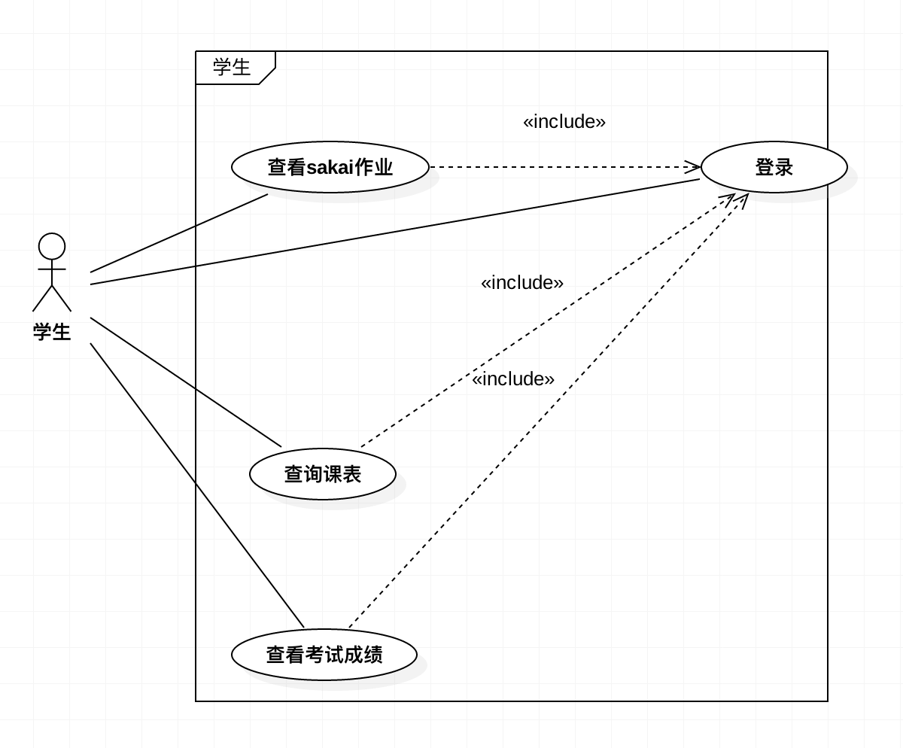

### 用例分析文档

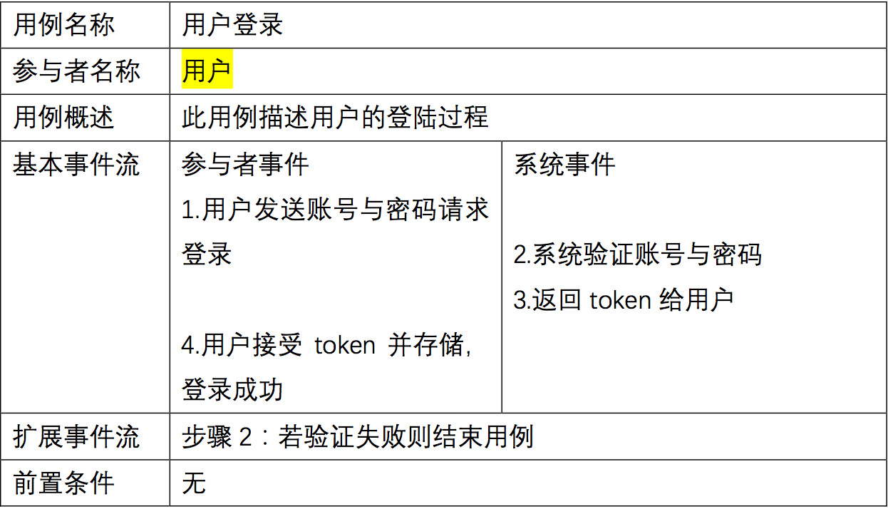

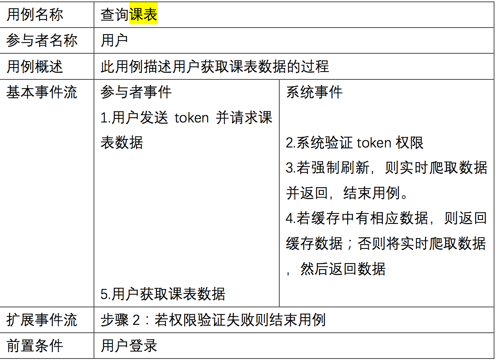

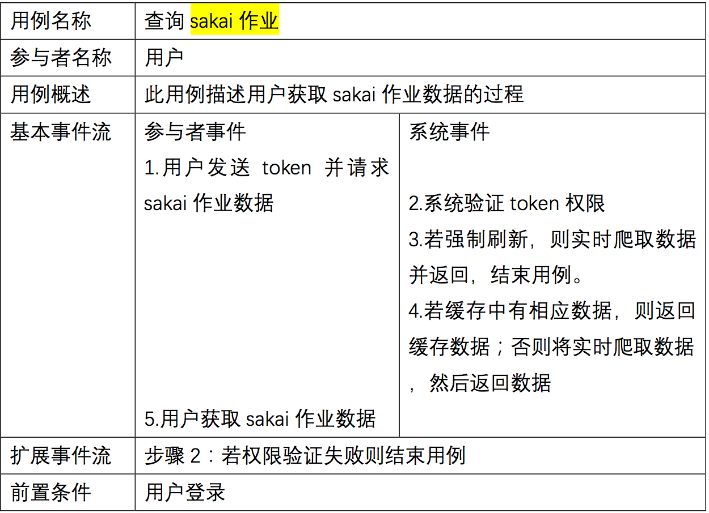

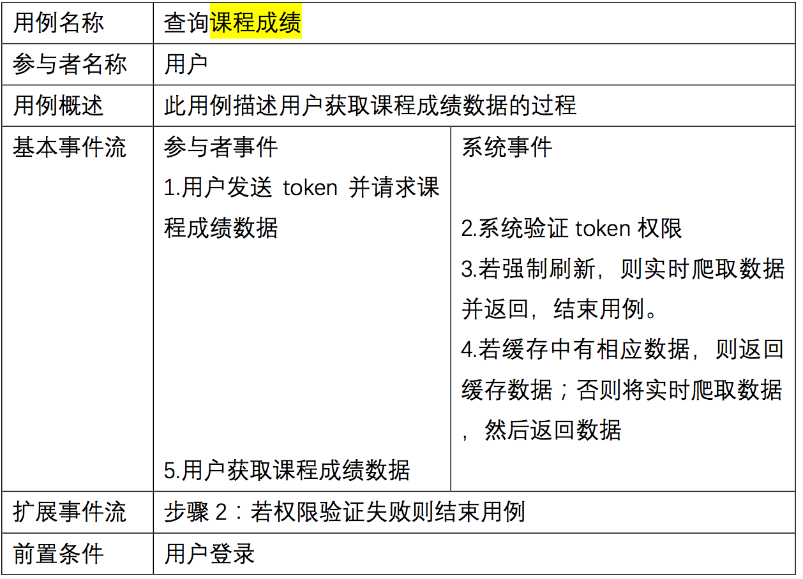

## 实体类类图

### 名词分析法

| 潜在类列表   | 是/否  | 类名/原因               |
| ------- | ---- | ------------------- |
| 用户      | 是    | User                |
| 课表      | 是    | CourseTable         |
| sakai作业 | 是    | SakaiHomework       |
| 课程成绩    | 是    | StudentAllTermGrade |

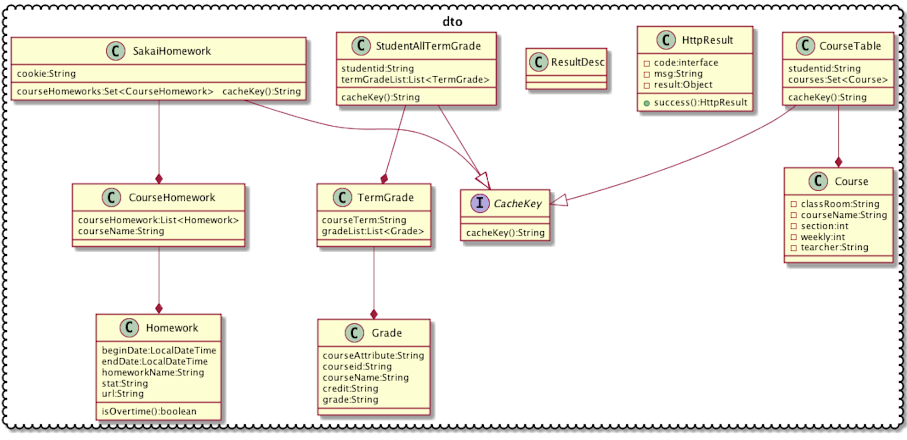

## 后端程序类图

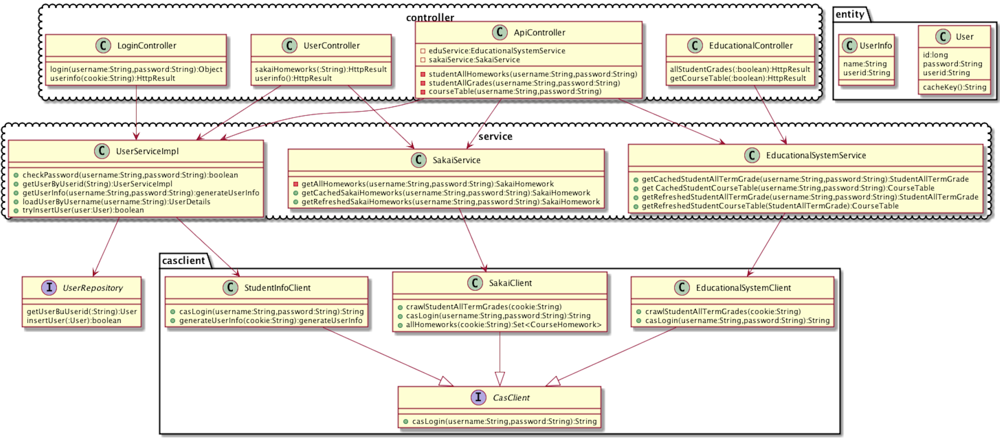

### controller层

controller层主要负责对外暴露的API服务，只依赖于service层的若干类。自身通过调用service层的类获取所需数据，对数据封装成HttpResult类然后转化成json格式返回给客户端。

controller负责进行权限验证，所有权限验证都在这一层进行。

### service层

service层主要负责数据的处理，只依赖与repository层与casclient层。

通过casclient层与repository层的类获取底层直接数据，自身会对数据进行特定处理，然后返回给controller层调用者。

### casclient层

casclient层负责实时数据的爬取工作，负责从学校的相关网站抓取所需的相关数据，然后返回给service层的调用者，不依赖与其他类而独立运行。

### repository层

即数据库层，负责操作数据库，本项目使用MySQL数据库，并使用MyBatis作为ORM框架。

### DTO类

DTO类是会在网络中进行数据传输的类，也是API返回数据时所封装的类。

### Entity类

Entity类是实体类，与DTO类类似，但本身不参与网络传输。

## 顺序图

### 登录

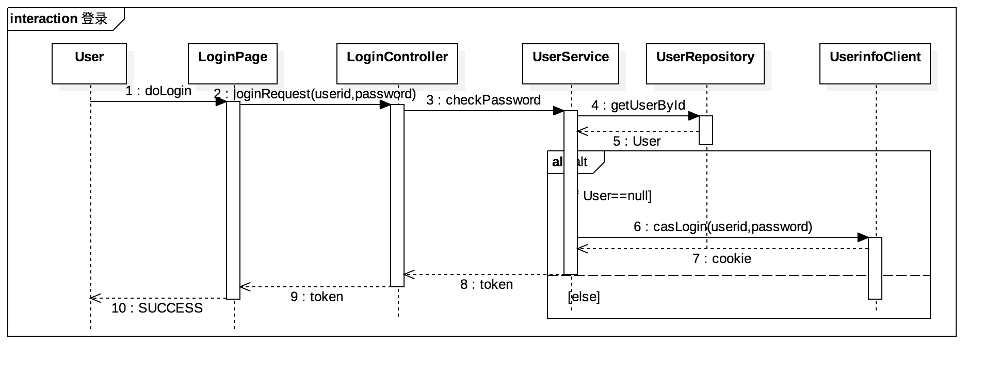

### 查看课表

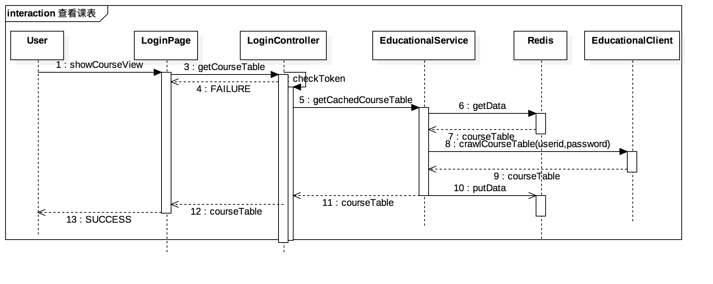

### 查看sakai作业

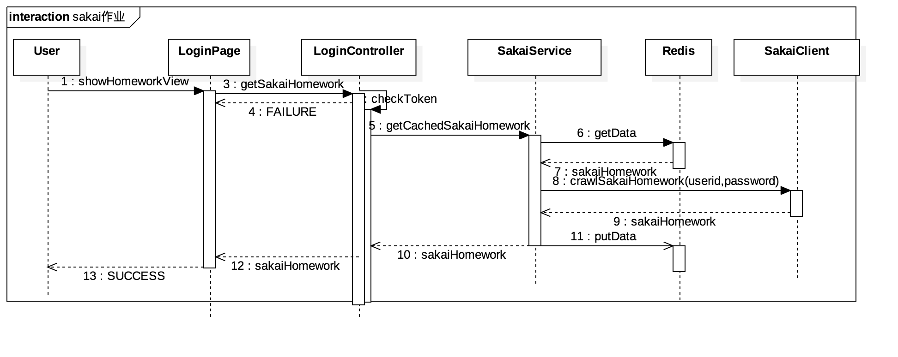

### ###查看课程成绩

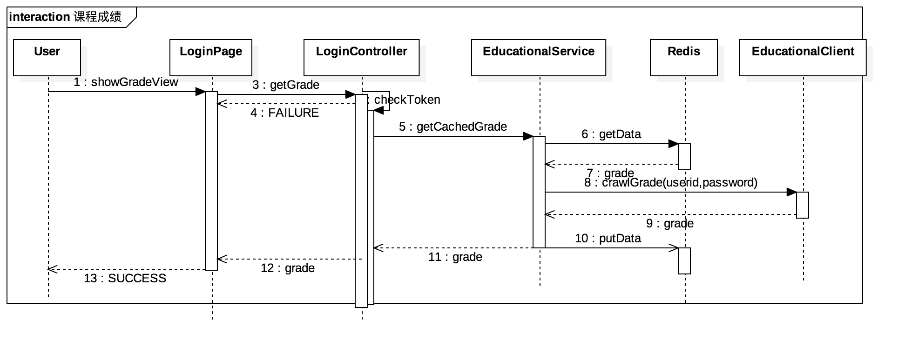

## 

## 前端UI设计

- 整个UI系统较简单，首界面为登录界面，验证登录获取token后进入到主界面
- 主界面包含课表界面、作业界面、成绩界面、个人信息界面等4个主要界面。
  - 主界面中各界面使用底部导航栏进行切换。

## 工作成果

### 后端

以 spring-boot 框架为核心，Java 与 Kotlin 语言为基础，使用web的MVC模式，完成了服务学生校 园生活的后端服务的开发。

### 后端服务功能

自动获取学生课程表、获取学生 sakai 作业、查询学生考试成绩等。

### 后端高级特性

基于 spring-security 的权限控制系统；基于 redis 的数据缓存系统；基于 Druid 框架的性能监控系统；基于 AOP 技术的日志框架。

### 前端

以 react-native 框架为核心，JavaScript 语言为基础，完成了学生助手的前端 Android 与 iOS 双平台 APP 的开发。

### APP 功能

登录模块；获取学生课表及相关的展示界面；获取学生 sakai 作业的模块与界面；查询学生考试成绩的模块与界面。

### 前端高级特性

基于 react-native-storage 的数据存储系统；基于react-native-tab-navigator 的底部导航栏；基于 whatwg-fetch 的网络请求模块。

## 后端工作内容

- 提供restful API接口
- 提供API接口说明文档

### 数据爬取

基于Jsoup框架，提交学号与密码给学校对应的服务器，对于返回的页面使用xpath解析，映射为类，然后返回，完成单次信息爬去。

共需要登录信息爬取、sakia作业爬取、学生课表爬取、学生成绩爬取等爬虫。

完成爬取后，会将相关信息存储至redis缓存中，则再次收到相同请求时优先返回缓存数据。

前端可以请求刷新缓存，即本次请求将爬取数据而不使用缓存数据。此操作将刷新对应的缓存数据。

### 数据返回

使用restful API，返回JSON格式的数据。

### 权限控制

使用spring-security框架，完成了基于ROLE规则的权限控制系统。

### 性能监控

基于Druid框架的性能监控系统，完成了对JDBC、web资源访问、token、IP等的监控。

### 日志系统

使用spring- AOP 技术，完成了日志系统的分离，完成扩展性较高的日志系统。

### 数据缓存

使用redis 存储数据，完成了对爬取数据、用户登录信息、权限认证信息等的缓存，大大降低了服务响应时间（从2秒降低到了40毫秒）。

## APP工作内容

### 本地数据缓存

使用react-native-storage 框架，完成了APP本地数据存储系统，降低了热启动的响应时间，避免重复获取数据。

### 底部导航栏

使用react-native-tab-navigator 框架，完成了APP的底部导航栏的开发，同时十分便于拓展。

### 页面设计

APP采用较流行的底部导航设计。

首页面为登录界面，当完成登陆后进入到主界面，此时可以查看课表、作业、成绩等数据界面。

## 数据通信

后端提供基于http协议的restful API。

前端使用 whatwg-fetch 网络请求模块，发送access_token及相应请求数据，服务端检查权限后返回对应数据。

## 测试

主要对后端服务进行测试。

### JUnit框架

使用JUnit框架完成内部单元测试，针对casclient层或service层的相关功能类，测试其所有对外接口。

测试结果：所有单元测试均通过。

具体测试代码及测试数据可参见项目地址https://gitlab.com/Darain/sustech-helper-server。

### Postman

使用postman程序完成对外部restful接口的测试。

主要测试其性能、响应时间、缓存生效与否等。

所有本地测试结果均合格。

### 存在问题与解决方案

根据postman测试结果，主要性能问题在于爬虫速度，由于网络限制以及页面解析速度，每次获取实时数据需要2~6秒（试网络情况而定），网络IO是限制服务器响应时间的最大因素。

根据此现象，加入了缓存模块，即服务器优先返回缓存数据，除非客户端主动声明需要实时数据或缓存过期或缓存不存在，才会实时爬取，返回实时数据。

这一功能使得服务器数据响应时间降低至30ms（本地），极大的提高了服务器的响应速度，并且降低服务器负载。